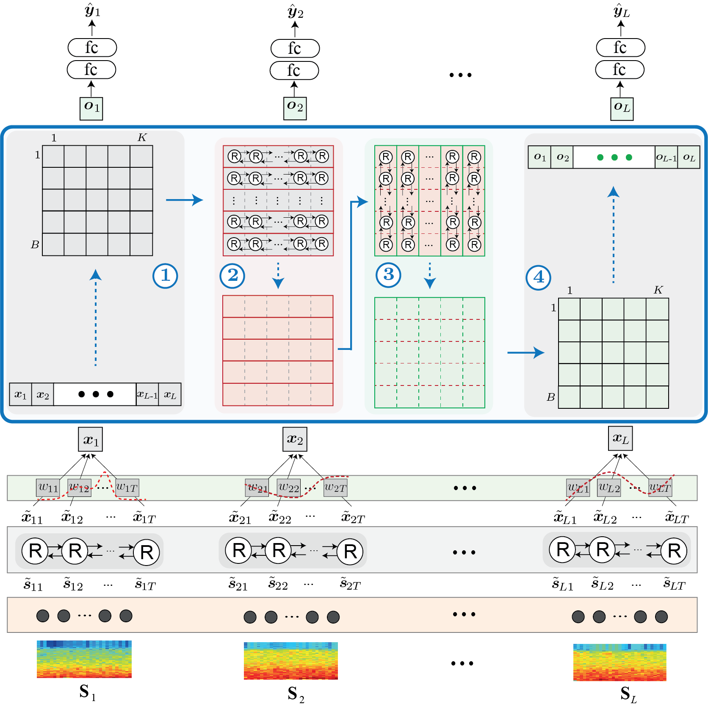

# L-SeqSleepNet

This is source code for L-SeqSleepNet described in the paper below. We used the SleepEDF-20 dataset to demonstrate how the package works. Please note that the implementation is not optimized in any sense.

- Huy Phan, Kristian P Lorenzen, Elisabeth Heremans, Oliver Y Chén, Minh C Tran, Philipp Koch, Alfred Mertins, Mathias Baumert, Kaare Mikkelsen, Maarten De Vos. __L-SeqSleepNet: Whole-cycle Long Sequence Modelling for Automatic Sleep Staging.__ _IEEE Journal of Biomedical and Health Informatics (JBHI)_, vol. 27, no. 10, pp., 2023. [[PDF]](https://ieeexplore.ieee.org/document/10210638) [[Preprint]](https://arxiv.org/pdf/2301.03441.pdf)

 
This repo contains:
- L-SeqSleepNet implementation in Tensorflow 1
- The prepared SleepEDF-20 database in mat files
	- (_Note: You can refer to other my other repos for how to process the data, for example https://github.com/pquochuy/xsleepnet_)
- Leave-one-subject-out experimental setup
- L-SeqSleepNet model weights pretrained on SHHS data 

Environment:
-------------
- Python3.7
- Tensorflow GPU 1.x (x >= 13) (for network training and evaluation)
- numpy
- scipy
- h5py
- sklearn
- imblearn

How to use:
-------------
1. Clone this repo which contains the prepared SleepEDF-20 database in mat files
2. Training/finetuning and testing
    - `cd ./edf/network/lseqsleepnet/`
    - `bash run_training_repeat1.sh` to train the network from scratch. The bash script includes the commands to do leave-one-subjet-out cross-validation training and testing. 
    - `bash run_finetune_repeat1.sh` to finetune from the SHHS-preptrained model. The bash script includes the commands to do leave-one-subjet-out cross-validation finetuning and testing. 
3. Evaluation
    - `bash evaluate_performance.sh` to evaluate the performance of the traning/finetuning experiments done in Step 2.

License
-------------
CC-BY-NC-4.0
